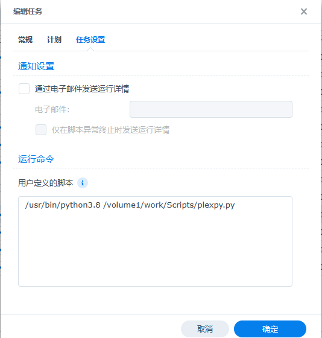
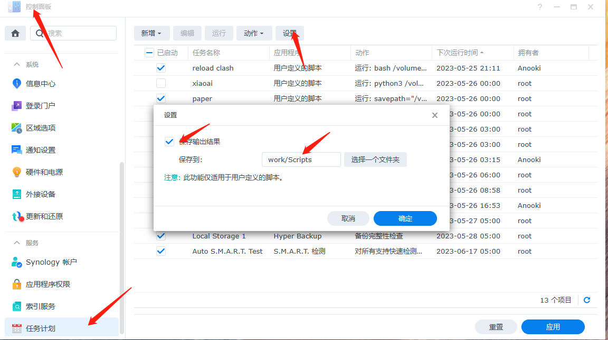

# 说明
1. 原脚本Github地址：https://github.com/sqkkyzx/plex_localization_zhcn
2. 原脚本需要手动选择媒体库，这个脚本改成了遍历所有的媒体库，其他无变化
# 前提条件
- 群辉安装了python
- 安装了pip

# 使用步骤
1. 将plexpy.py和config.ini文件放在群晖的任意位置，只要plex可以访问即可
2. 在config.ini文件中配置plex的的host和token
3. 安装必要的python包，保险起见configparser、pypinyin、requests、pathlib这几个依赖包都装一下

    `pip install pypinyin`
4. 群辉设置计划任务，常规和计划自己看着设置就行，主要是任务设置如下：

    
   1. `/usr/bin/python3.8`是python的路径
   2. `/volume1/work/Scripts/plexpy.py`是你脚本文件存放的位置
5. 可以通过计划任务的执行结果看是否设置成功

# 计划任务输出结果查看方式
   控制面板-计划任务-设置-保存输出结果

   
